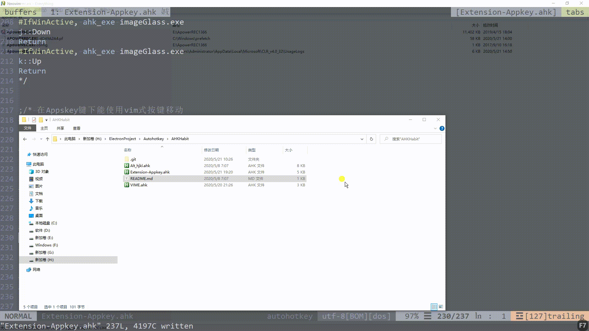
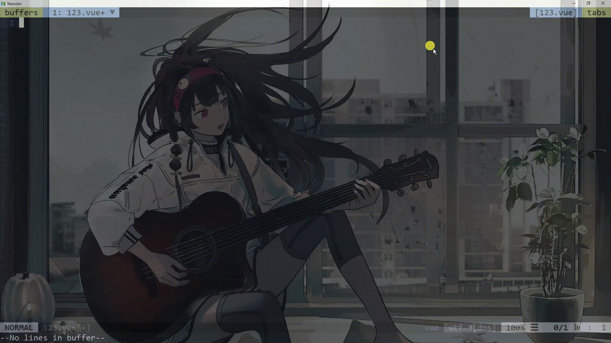
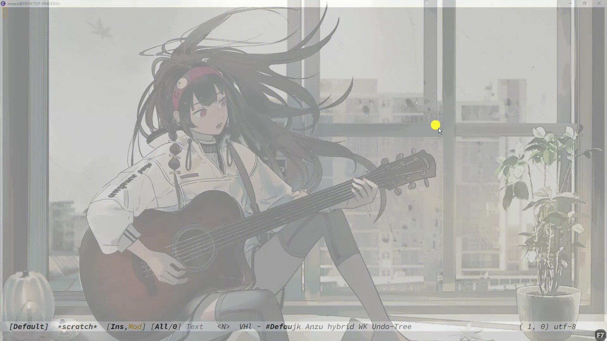
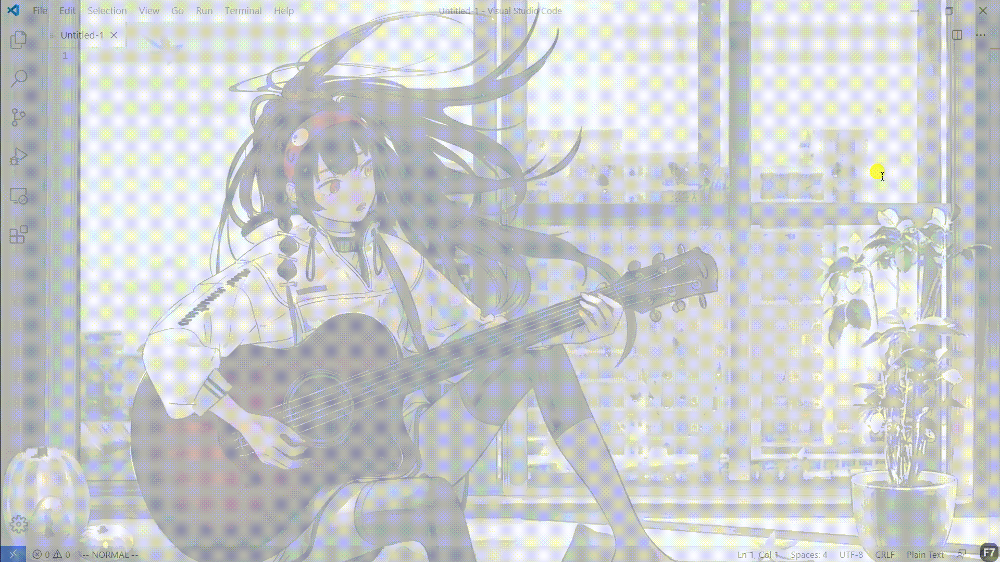

# AHKHabit
## English | [简体中文](https://github.com/WingDust/AHKHabit/README.zh_CN.md)

### （AutoHotkey Setings in Windows）

## Remapping Right-WIN  Appkeys , So You don't can move you right hand ,that So far away from me the ******* Big Enter key. And Appkeys's Window also can move like vim Left Right Up Down.In Some Winodw Such as Spacemacs , Neovim Cmder Powershell ... It auto turn to Enter . Typing hand with out move.
  > because of Record Soft I need to click Window one times.

## Use [Rime/Weaser](https://github.com/rime/weasel) in Vim Ecosystem Such Neovim 、Spacemacs 、VScode ... to Auto change Chinese IME to reset English in Vim Normal Mode

  > because of Record Soft I need to click Window one times.

  - Neovim
    

  - Spacemacs
    

  - VScode
    
    

## 88 键钢琴架构
    1   2   3
    4   5   6   7   8   9   10  11  12  13  14  15
    16  17  18  19  20  21  22  23  24  25  26  27
    28  29  30  31  32  33  34  35  36  37  38  39
    40  41  42  43  44  45  46  47  48  49  50  51
    52  53  54  55  56  57  58  59  60  61  62  63
    64  65  66  67  68  69  70  71  72  73  74  75
    76  77  78  79  80  81  82  83  84  85  86  87
    88
    
|     | C   | C#  | D   | D#  | E   | F   | F#  | G   | G#  | A   | A#  | B   | 音区   |
| --- | --- | --- | --- | --- | --- | --- | --- | --- | --- | --- | --- | --- | ---- |
| 1   | 4   | 5   | 6   | 7   | 8   | 9   | 10  | 11  | 12  | 13  | 14  | 15  | 低    |
| 2   | 16  | 17  | 18  | 19  | 20  | 21  | 22  | 23  | 24  | 25  | 26  | 27  | 音    |
| 3   | 28  | 29  | 30  | 31  | 32  | 33  | 34  | 35  | 36  | 37  | 38  | 39  | 中    |
| 4   | 40  | 41  | 42  | 43  | 44  | 45  | 46  | 47  | 48  | 49  | 50  | 51  | //// |
| 5   | 52  | 53  | 54  | 55  | 56  | 57  | 58  | 59  | 60  | 61  | 62  | 63  | 音    |
| 6   | 64  | 65  | 66  | 67  | 68  | 69  | 70  | 71  | 72  | 73  | 74  | 75  | 高    |
| 7   | 76  | 77  | 78  | 79  | 80  | 81  | 82  | 83  | 84  | 85  | 86  | 87  | 音    |
| 8   | a   | q   | s   | w   | d   | f   | e   | z   | r   | x   | t   | c   | //// |
| 9   | h   | y   | j   | u   | k   | l   | i   | b   | o   | n   | p   | m   | //// |
| 10  | j   | y   | k   | u   | l   | ;   | i   | n   | o   | m   | p   | ,   | //// |
| 11  | 0   | 1   | 2   | 3   | 4   | 5   | 6   | 7   | 8   | 9   | 10  | 11  | //// |

- 9 
