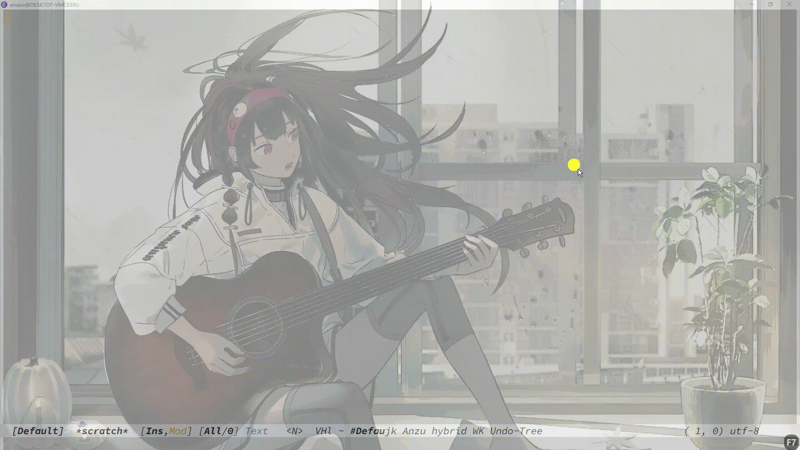

# AHKHabit
## English | [简体中文](https://github.com/WingDust/AHKHabit/README.zh_CN.md)

### 在 Windows 上一系列的 AutoHotkey 设置 

## 重映射 右 WIN 键 为 Appkeys ,并在这个窗口下以 Vim 式上下左右移动造成选择项，在一些窗口下将自动的将 Appkeys 设置为 Enter

## 在Vim的生态系统中自动将插入模式下回到普通模式时将 [Rime/Weaser](https://github.com/rime/weasel) 重置为英文

  > 这里使用录制软件所以需要鼠标去点击一下，正常不需要。

  - Neovim
  

  - Spacemacs
  

  - VScode
  
